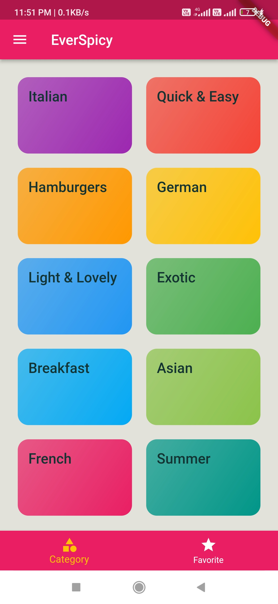
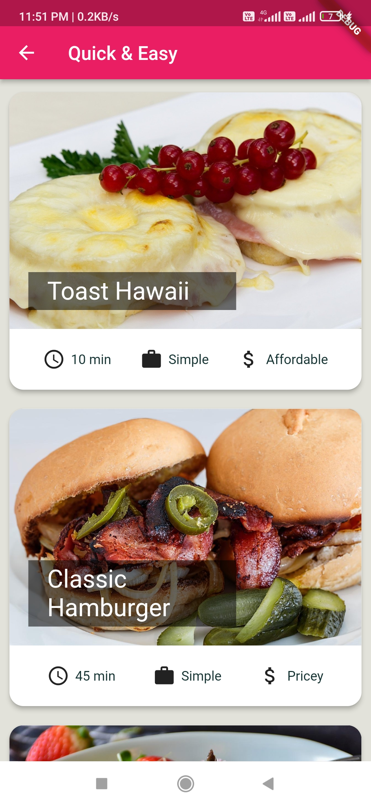
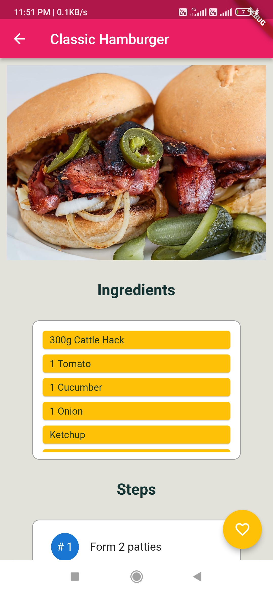

# EverSpicy
> Recipe Book App

<p align="center">
  
</p>

<p align="center"><ahref="https://github.com/subrotokumar/everspicy/releases">  </ahref=></p>
<p align="center">
<a href="https://github.com/subrotokumar/meme-explorer" alt="GitHub release"></a>
<hr>

## Screenshot 

<p align="center">



</p>

### Features
- Beautiful Material UI.
- Filter Option that show recipes on basis on various parameters.
- Favorite Page to store your favorite dishes in separate place.
- Available for Android, iOS, Windows, Linus, macOS.

### Tools and Dependencies used 

- Programming Language : **Dart**
- Framework : **Flutter**
- **Android Studio**

### Getting Started

You can build and run this by following these steps:

```bash
git clone https://github.com/subrotokumar/everspicy.git
cd everspicy
flutter run
```

## Contribution
Your ideas, translations, design changes, code cleaning, or real heavy code changes or any help is always welcome. The more is contribution the better it gets

[Pull requests](https://github.com/everspicy/pulls) will be reviewed
<!--
#### Known issues and limitations
-->


